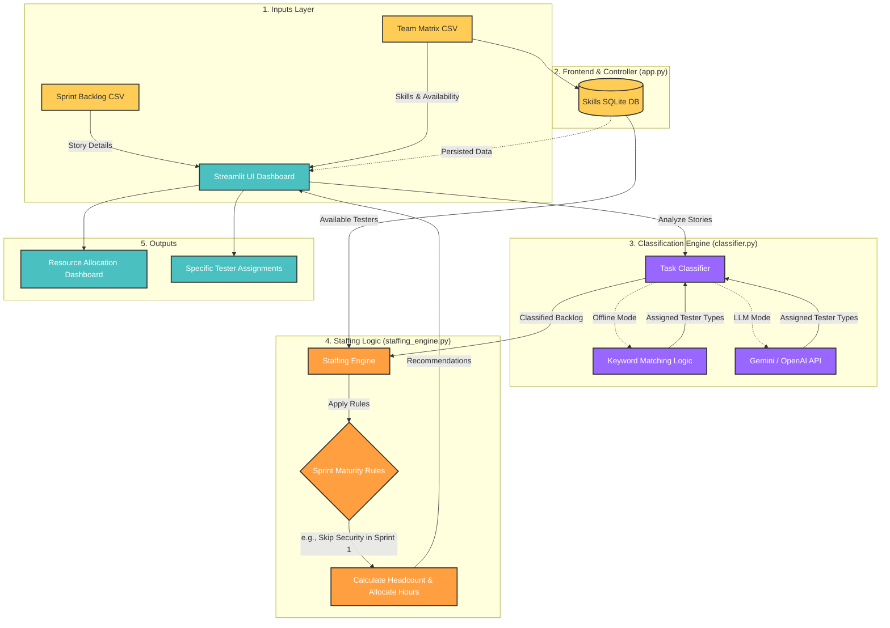

# QE-Predictor: Sprint Staffing Intelligence Tool

A Streamlit application that intelligently predicts QA staffing needs based on sprint backlog items. It uses keyword-based classification, optional LLM augmentation (Gemini/OpenAI), and sprint-maturity heuristics to recommend the right testers for each sprint.

## System Architecture



## Setup

1. Create a virtual environment and install dependencies:
   ```bash
   python -m venv venv
   source venv/bin/activate
   pip install -r requirements.txt
   ```

2. (Optional) Copy `.env.example` to `.env` and add your API keys:
   ```bash
   cp .env.example .env
   ```
   *Note: Without an API key, the tool will fall back to keyword-based classification.*

## Running the App

Start the Streamlit development server:

```bash
streamlit run app.py
```

## How It Works

1. **Upload Backlog**: Upload a CSV of your sprint tasks containing `Title`, `Description`, `Story Points`, and `Sprint Number`. (See `sample_data/sample_backlog.csv`).
2. **Upload Testers**: Upload a CSV of your available testers with `Name`, `Type`, `Proficiency`, and `Available Hours`. (See `sample_data/sample_testers.csv`).
3. **Run Analysis**: The app classifies each User Story (Manual, Automation, Performance, Security, Accessibility) and applies heuristics.
4. **View Recommendations**: Explore the Dashboard to see recommended team composition and task-level assignments.
